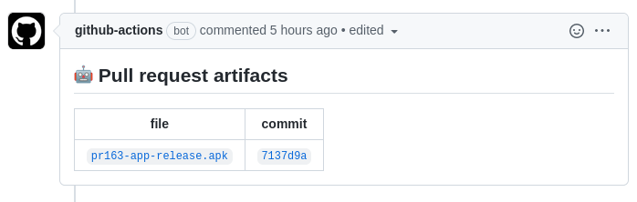

# pull-request-artifacts [](https://github.com/gavv/pull-request-artifacts/actions/workflows/build.yml)

This GitHub Action uploads specified build artifacts (arbitrary files) from a PR to given repo and posts a PR comment with links to the uploaded artifacts.

For example, you can use it to automatically upload APK or App Bundle to make it easy to test the PR during review.



## Parameters

| parameter          | description                                                      |
| ---------          | -----------                                                      |
| `commit`           | Commit hash that triggered PR                                    |
| `repo-token`       | Token for current repo (used to post PR comment)                 |
| `artifacts`        | Space-separated list of files to upload                          |
| `artifacts-token`  | Token for artifacts repo (if it differs from current repo)       |
| `artifacts-repo`   | Repo where to upload artifacts (defaults to current repo)        |
| `artifacts-branch` | Branch where to upload artifacts (defaults to default branch)    |
| `artifacts-dir`    | Directory where to upload artifacts (defaults to root directory) |

## Example usage

Push to the same repo, but another branch:

```yaml
steps:
  - name: Pull request artifacts
    if: ${{ github.event_name == 'pull_request' }}
    uses: gavv/pull-request-artifacts@v1.0.0
    with:
      commit: ${{ github.event.pull_request.head.sha }}
      repo-token: ${{ secrets.GITHUB_TOKEN }}
      artifacts-branch: artifacts
      artifacts: |
        some/file.exe
        another/file.exe
```

Push to another repo, default branch:

```yaml
steps:
  - name: Pull request artifacts
    if: ${{ github.event_name == 'pull_request' }}
    uses: gavv/pull-request-artifacts@v1.0.0
    with:
      commit: ${{ github.event.pull_request.head.sha }}
      repo-token: ${{ secrets.GITHUB_TOKEN }}
      artifacts-token: ${{ secrets.ANOTHER_TOKEN_WITH_PUSH_ACCESS }}
      artifacts-repo: some/repo
      artifacts: |
        some/file.exe
        another/file.exe
```
